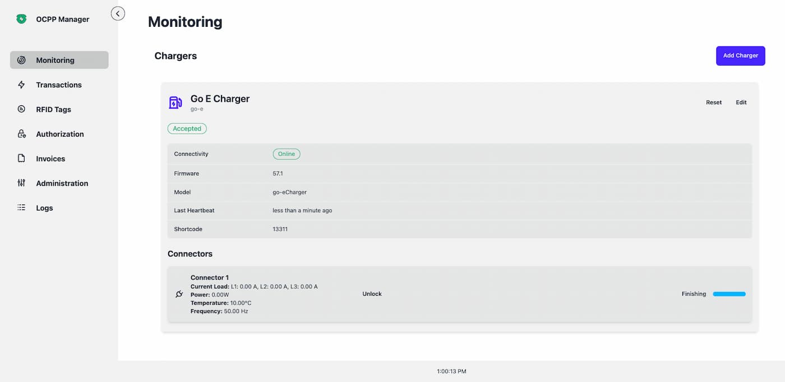

# davbauer/ocpp-manager

<div style="text-align: center;">
  
</div>

## Preview



## Overview

OCPP Manager is an application built with HonoJS for the backend and SvelteKit for the frontend.

### Features:

- **Charging Station Management**: Add and monitor charging stations and their associated connectors.
- **RFID Card Setup**: Manage RFID cards, including setting up expiring authorizations to allow or restrict charging.
- **Transaction Records**: Track all transactions and estimate ongoing transaction details.

## Development Setup

1. Rename `.env.example` files in both the `app` and `api` directories to `.env`.

2. Install dependencies and build the frontend:

   ```bash
   cd app
   yarn
   yarn build
   cd ../
   ```

3. Start the local development PostgreSQL database:

   ```bash
   cd local
   docker compose up
   ```

4. In a new terminal, apply database migrations and start the API:
   ```bash
   cd api
   yarn
   yarn migrate:run
   yarn dev
   ```

Now you're ready to start developing!
